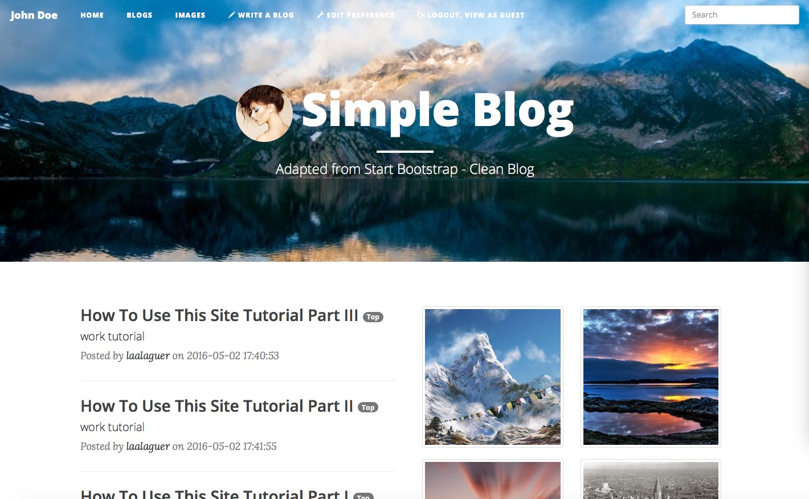

# Simple Personal Blog on GAE
A personal blog, sits on the Google App Engine and `webapp2` framework

## Demo
[Demo Site Link](http://simple-personal-blog.appspot.com/)

## Features:
Read the Following Three Articles about what we provide:
[Tutorial #1](http://simple-personal-blog.appspot.com/view_blog/4e595a50cdaa81293bfff01757a4193a)
[Tutorial #2](http://simple-personal-blog.appspot.com/view_blog/c5c448bf1770b1aac5c7ff2d25ebaa94)
[Tutorial #3](http://simple-personal-blog.appspot.com/view_blog/61c4148148c68e7a8308f379159698ba)

## For Developers:
If you are going to deploy one of your own, please following these steps
	0. Apply for a Google App Engine application ID as usual.
	1. Change the app id to your app id in `app.yaml`.
	2. Change the `blogadmins.py` to include your google email address.
	3. Change the `MY_SECRET_LOGIN_URL` inside `main.py` to your favourite login spot of application.
	4. Start to deploy and enjoy via regular Google App Engine test-devlope-deploy process.
	
## Thanks
	1. Dropzone.js - [Dropzone JS](http://www.dropzonejs.com)
	2. Minified.js - [Minifed JS](http://minifiedjs.com)
	3. Clean Blog - [Clean Blog](https://github.com/BlackrockDigital/startbootstrap-clean-blog)